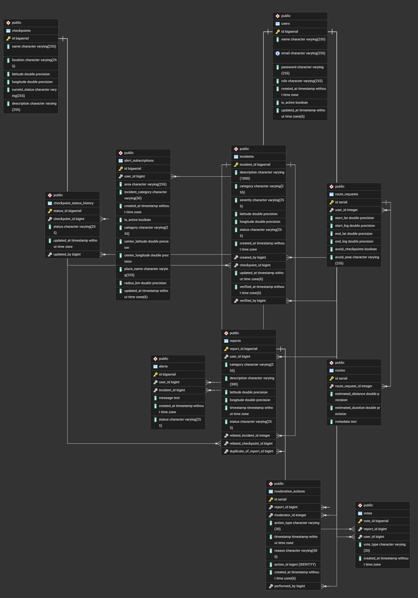

# 🗄️ Database Schema (ERD)

## Overview

The Wasel Palestine platform uses a PostgreSQL relational database designed to support mobility intelligence, checkpoint management, crowdsourced reporting, alerts, and route estimation.

The schema is structured to ensure data consistency, maintainability, and scalability through the use of relational tables, foreign keys, and integrity constraints.

---

## ERD Diagram

---

## Main Tables

### Users
Stores user accounts, authentication credentials, roles, and account activity status.

### Checkpoints
Stores checkpoint names, locations, coordinates, and current operational status.

### Checkpoint Status History
Tracks historical checkpoint status changes over time.

### Incidents
Stores road incidents such as delays, closures, accidents, and weather hazards.

### Reports
Stores crowdsourced reports submitted by users with category, description, and location.

### Votes
Stores report votes used for credibility scoring.

### Moderation Actions
Stores moderation and verification actions performed on reports.

### Alert Subscriptions
Stores user notification preferences based on category and geographic area.

### Alerts
Stores generated alerts triggered by incidents or user subscriptions.

### Route Requests
Stores route search requests including start point, destination, and constraints.

### Routes
Stores estimated route results including distance, duration, and metadata.

---

## Key Relationships

- One user can create multiple reports.
- One user can create multiple alert subscriptions.
- One report can receive multiple votes.
- One report can have multiple moderation actions.
- One checkpoint can have multiple incidents.
- One checkpoint can have multiple status history records.
- One route request can generate route results.
- One incident can trigger multiple alerts.

---

## Design Notes

- PostgreSQL was selected for reliability and strong relational support.
- Foreign keys are used to preserve referential integrity.
- Unique constraints prevent duplicate records.
- The schema is modular and scalable for future enhancements.

---
